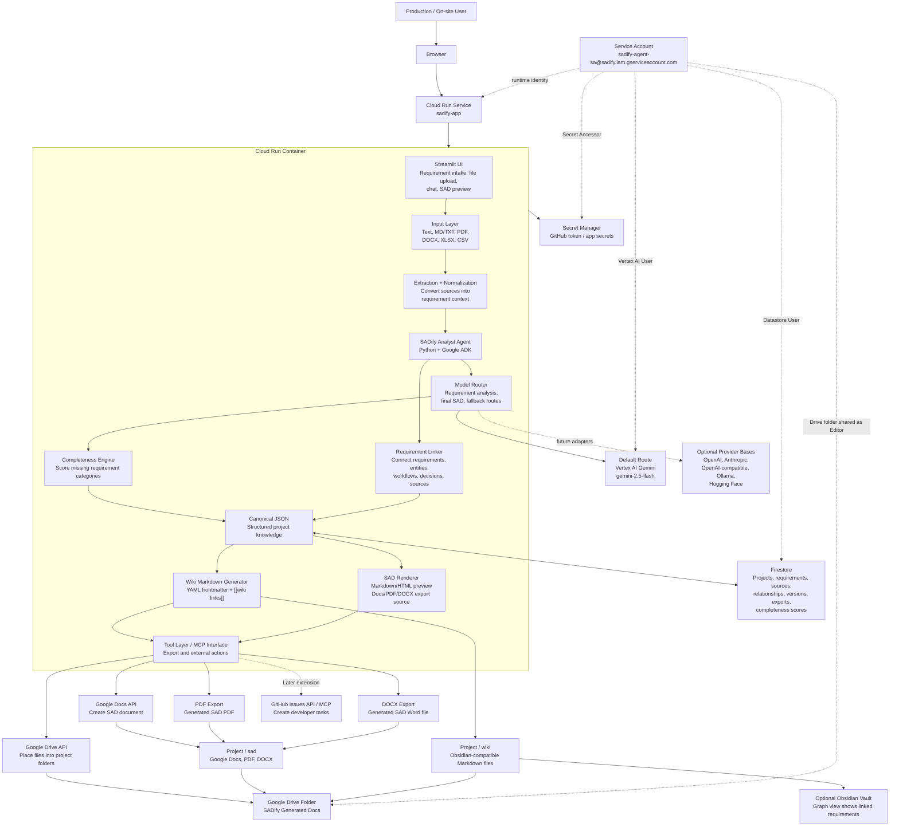
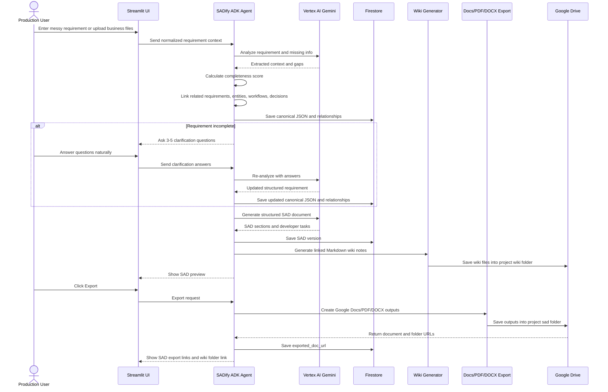

# SADify Architecture Diagram

Created: 2026-04-29  
Last updated: 2026-05-04

This diagram visualizes the MVP architecture from the SADify Google Cloud plan, updated on 2026-04-30 to include the connected wiki knowledge layer.

## Traceability Sources

This architecture diagram should be verified against:

- `docs/superpowers/development/00_development_index.md`
- `docs/superpowers/development/03_data_model_and_output_schema.md`
- `docs/superpowers/development/04_google_cloud_setup_runbook.md`
- `docs/superpowers/development/05_development_workflow.md`
- `docs/superpowers/research/2026-05-02-track-1-resource-link-analysis.md`

If the architecture changes, update the setup runbook, data schema, workflow checkpoints, and affected tests.

## MVP Runtime Architecture



## Wiki Knowledge Layer

SADify should generate an Obsidian-compatible Markdown wiki from the same canonical JSON used for SAD exports. This makes the project knowledge chunked, linked, and explorable.

```text
Google Drive/
  SADify Generated Docs/
    Project Name/
      sad/
        SAD-v1.google_doc
        SAD-v1.pdf
        SAD-v1.docx
      wiki/
        requirements/
          REQ-001-fertilizer-application-logging.md
          REQ-002-worker-attendance.md
        entities/
          ENT-001-worker.md
          ENT-002-field-block.md
        workflows/
          WF-001-fertilizer-recording.md
        decisions/
          DEC-001-offline-mode-needed.md
        sources/
          SRC-001-uploaded-sop.md
```

Example wiki note shape:

```markdown
---
id: REQ-001
type: requirement
status: draft
completeness: 72
confidence: medium
sources:
  - SRC-001
related:
  - REQ-002
shared_entities:
  - ENT-001
  - ENT-002
---

# Fertilizer Application Logging

## Summary
Field staff need to record fertilizer application by block, date, worker, and fertilizer type.

## Related Notes
- [[REQ-002-worker-attendance]]
- [[ENT-001-worker]]
- [[ENT-002-field-block]]
- [[WF-001-fertilizer-recording]]

## Open Questions
- [HIGH] Who verifies the fertilizer record?
- [MEDIUM] Is offline entry required in the field?
```

## Main User Flow



## Design Notes

- One Cloud Run service keeps the hackathon MVP simple and avoids frontend/backend deployment overhead.
- Vertex AI Gemini is the default reasoning layer; Firestore is the memory/state layer.
- SADify now has a provider-neutral model router for requirement analysis, final SAD generation, and optional fallback metadata.
- Non-Google provider adapters are future until the requirement-analysis flow exists and can test them against real SADify behavior.
- Firestore stores the canonical structured data. Markdown wiki files are generated from that structure for human navigation and Obsidian graph view.
- Google Docs, PDF, and DOCX export are normal user-facing outputs.
- The wiki knowledge layer is an MVP architecture concept, but Obsidian itself is optional. SADify only needs to generate compatible Markdown files.
- Tool boundaries should be MCP-compatible. A remote MCP server is future only; the MVP can start with clean Python tools inside the ADK agent.
- GitHub Issues export is intentionally marked as a later extension.
- `roles/run.invoker` is not required for the runtime service account when the demo service is public through `--allow-unauthenticated`.
