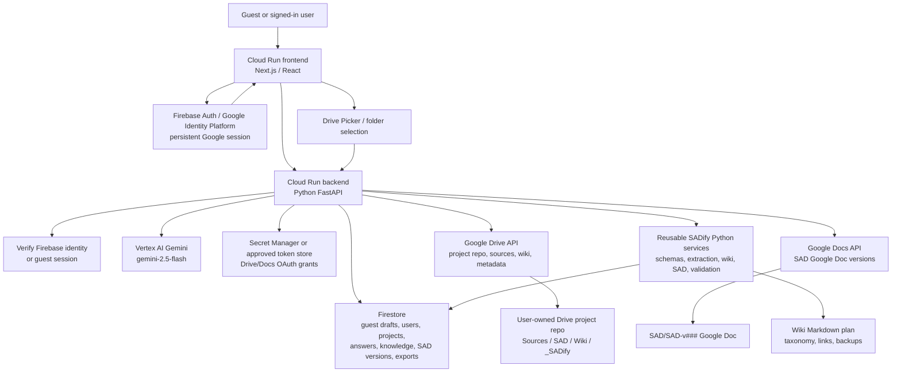

# SADify MVP Web Architecture

Created: 2026-05-11
Status: Draft for user review

## Purpose

This diagram shows the planned MVP architecture after the Streamlit prototype baseline.

The older architecture diagram remains the prototype reference. This document is the target architecture for the proper MVP web app.

## Runtime Architecture



## First Thin Slice

```text
Next.js frontend
-> FastAPI backend
-> guest Firestore draft
-> live Gemini structured analysis
-> first Q&A state saved
```

## Drive Repo Shape

```text
Project Name/
  Sources/
  SAD/
  Wiki/
  _SADify/
```

## Key Boundaries

| Boundary | Rule |
| --- | --- |
| Frontend to Firestore | Frontend does not write canonical Firestore records directly. |
| Frontend to Drive/Docs | Frontend does not write generated artifacts directly. |
| Backend to Gemini | Gemini responses must validate against strict schemas before use. |
| Backend to Drive/Docs | Backend writes using the user's approved Drive/Docs grant. |
| Wiki updates | Existing wiki is reverified before update; new folders/files require approval. |
| SAD versions | Formal versions are append-only except approved current pointers. |
