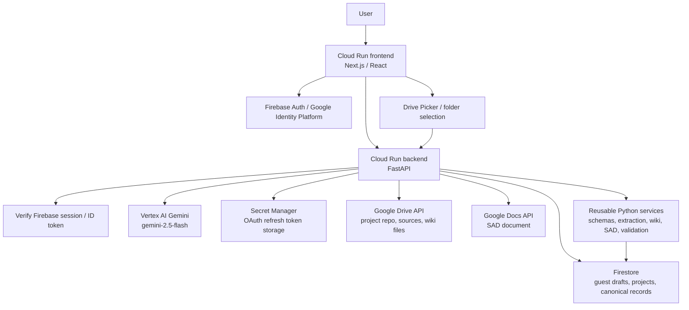

# SADify Prototype To MVP Web App Design

Date: 2026-05-11
Status: Draft for user review

## Purpose

This spec records the approved direction for moving SADify from the current functional prototype into a proper MVP.

The current prototype proves the core idea:

```text
messy business request
-> requirement understanding
-> readiness/confidence
-> missing information
-> deterministic local SAD/wiki/export generation
```

The MVP must prove a stronger product:

```text
guest or signed-in user
-> live Gemini analyst Q&A
-> structured project memory in Firestore
-> SAD preview
-> user-owned Drive project repo
-> saved SAD Google Doc, wiki Markdown, and source files
```

This is a product and architecture shift, not a small Streamlit improvement.

## Revalidated Baseline

Baseline verification on 2026-05-11:

```text
.\.venv\Scripts\pytest.exe -q
91 passed in 13.54s
```

Current reusable pieces:

- Pydantic canonical schemas.
- Business file extraction for MD, TXT, PDF, DOCX, XLSX, and CSV.
- Deterministic requirement analysis and completeness concepts.
- Relationship graph and wiki Markdown renderer concepts.
- Wiki verification and owner approval concepts.
- Project-level SAD version concepts.
- Local export package concepts.
- Firestore repository abstraction with fake-client tests.
- Model route metadata for requirement analysis, final SAD, and fallback.
- ADK-compatible `sadify_agent.root_agent`.

Current missing MVP pieces:

- Next.js frontend.
- FastAPI backend.
- Firebase Auth / Google Identity Platform sign-in.
- Persistent guest draft sessions in Firestore.
- Guest-to-signed-in migration.
- Live Gemini structured JSON calls.
- OAuth Drive/Docs grant and stored refresh-token flow.
- Google Drive Picker or equivalent folder selection.
- User-owned Drive/Docs writes.
- Real deployed full-stack smoke across frontend, backend, Gemini, Firestore, Drive, and Docs.

## Confirmed MVP Decisions

| Area | Decision |
| --- | --- |
| Product target | Move from functional proof to proper MVP. |
| Active model | Use Gemini first. |
| Future priority | Model switching/provider routing is future priority 1, but no model picker in first MVP. |
| AI behavior | Gemini handles key reasoning: analysis, next question, answer interpretation, SAD generation, wiki update planning. |
| Output safety | Gemini outputs must validate against strict structured schemas before rendering or saving. |
| Frontend | Replace Streamlit MVP foundation with Next.js/React. |
| Backend | Add Python FastAPI backend and reuse existing Python services where practical. |
| Runtime | Two Cloud Run services: frontend and backend. |
| Repo shape | Same repo monorepo. |
| Auth | Firebase Auth / Google Identity Platform. |
| Firestore access | Backend only. Frontend does not write canonical Firestore records directly. |
| Guest mode | Guest can analyze, answer Q&A, and generate temporary SAD preview. |
| Guest persistence | Guest drafts persist in Firestore. |
| Migration | Safer audit migration: copy guest draft into signed-in project and link both records. Ask before migration. |
| Drive ownership | User owns generated files through Google OAuth. |
| Drive permission timing | Ask Drive/Docs permission when connecting project repo, not at first sign-in. |
| OAuth token handling | Backend-mediated grant/token store with disconnect flow. |
| Session | Keep login/session persistent so users do not repeatedly sign in. |
| Project repo | User can select an existing Drive folder or create a new project repo. |
| Save outputs | First MVP saves SAD Google Doc, wiki Markdown files, and raw/source files. |
| Source extraction storage | Originals in `Sources/`; extracted normalized text in `_SADify/`. |
| Source traceability | Required in SAD and wiki. |
| Assumptions | Allowed only when clearly labeled and shown before save. |
| Q&A | One simple question at a time, always with choices and an amend/free-text option. |
| Q&A categories | Fixed core categories plus reviewed AI-proposed project-specific extras. |
| Question priority | Backend-selected active category and slot; Gemini phrases the next best question inside that locked target. |
| User explanation | Show a short plain-language "why this matters" for each question. |
| Readiness | Show friendly backend-calculated readiness; keep AI confidence diagnostic only. |
| Preview gate | SAD preview allowed after blocking basics are answered: problem, goal, users/roles, and workflow. |
| IT readiness | Internal checklist required before save; show results in user-friendly terms. |
| Approval UX | Show simple change summary with paths/sources; hide technical details by default. |
| Change tracking | Always show one-line change tracking; expandable details show file paths. |
| Workflow phase | Keep workflow phase/status in an expandable project status section. |
| Diagnostics | Hidden dev diagnostics page for Gemini, Firestore, Drive, Docs, auth, and session health. |
| Testing gate | Each cloud feature needs local tests, browser smoke, and deployed smoke before proceeding. |

## Superseded Prototype Decisions

The following older decisions remain historically valid for the prototype, but are superseded for the MVP:

| Old Decision | MVP Replacement |
| --- | --- |
| Streamlit is the MVP UI | Streamlit is the proven prototype only. MVP uses Next.js/React. |
| One Cloud Run service | MVP uses separate frontend and backend Cloud Run services. |
| Service account writes into a pre-shared Drive folder | User-owned Drive files through OAuth. |
| `SADIFY_DRIVE_ROOT_FOLDER_ID` config controls Drive readiness | Signed-in user connects/selects/creates a Drive project repo. |
| Deterministic local analysis is enough | Live Gemini structured reasoning is required. |
| Local export package is enough | Real Google Docs/Drive save is required. |
| PDF/DOCX are first export outputs | First MVP save focuses on SAD Google Doc, wiki Markdown, and sources. PDF/DOCX return after core Drive/Docs wiring is stable. |

## Target Monorepo Shape

Proposed repo structure:

```text
apps/
  web/
    Next.js / React frontend
services/
  api/
    FastAPI backend
packages/
  shared/
    optional shared TypeScript contracts later
src/
  sadify/
    existing reusable Python services and schemas
sadify_agent/
  ADK-compatible root_agent remains available
tests/
  existing Python tests
```

The first implementation should not rewrite all existing Python services. It should wrap and refactor them behind clean FastAPI boundaries, then replace deterministic reasoning with Gemini-backed adapters feature by feature.

## Runtime Architecture



## User Modes

### Guest Mode

Guest mode is for trying the analyst without committing to Drive:

```text
open app
-> guest draft is created in Firestore
-> user enters request and uploads optional files
-> Gemini asks one simple question at a time
-> guest can generate temporary SAD preview after blocking basics
-> guest cannot save/export SAD/wiki/source files to Drive
```

Guest draft data must be persisted, not only stored in browser memory.

### Signed-In Mode

Signed-in mode is for real project work:

```text
sign in with Google
-> persistent app session
-> optionally migrate current guest draft
-> select or create Drive project repo
-> connect Drive/Docs permission
-> review proposed changes
-> save SAD, wiki, sources, and metadata
-> Firestore keeps project history
```

### Guest To Signed-In Migration

Use safer audit migration:

```text
guest_drafts/{guest_draft_id} remains intact
-> user signs in
-> app asks "Continue this draft as a signed-in project?"
-> backend creates projects/{project_id} copy
-> project records migrated_from_guest_draft_id
-> guest draft records migrated_to_project_id and migrated_at
-> user selects or creates Drive repo
```

## Q&A Workflow

The MVP should feel like a plain-language analyst, not a form.

Always-visible main content:

- Current simple question.
- Answer choices.
- Amend answer field.
- Short "why this matters".
- Friendly overall readiness label and percentage.
- Question-area word statuses.
- One-line change tracking summary.

Expandable content:

- Project status timeline.
- Detailed changed file paths.
- Source traceability.
- Technical validation details.
- Developer diagnostics.

Core questionnaire categories:

```text
problem
goal
users_roles
workflow
data
rules_approvals
exceptions
reports
permissions
integrations
non_functional
risks
open_questions
```

Priority order:

1. Blocking basics: problem, goal, users/roles, workflow.
2. System shape: data, statuses, business rules, approvals.
3. Operational reality: exceptions, corrections, audit/history, reports.
4. IT readiness: permissions, integrations, non-functional needs, security constraints.
5. Reviewed AI-proposed project-specific extras.

Question format:

```text
Question:
When should a stock movement become official?

Why this matters:
This decides whether the system needs supervisor approval, correction history, or audit tracking.

Choices:
A. Right after operator scans
B. After operator submits
C. After supervisor approves
D. Not sure
E. Other / amend answer
```

## Project Repo And Drive Structure

User chooses or creates the project repo folder. SADify creates and manages this structure:

```text
Project Name/
  Sources/
  SAD/
  Wiki/
  _SADify/
```

Folder purposes:

| Folder | Purpose |
| --- | --- |
| `Sources/` | Original uploaded files. Never overwrite. |
| `SAD/` | Human-facing SAD Google Docs. Versioned. |
| `Wiki/` | Latest living project brain. No visible stale version folders. |
| `_SADify/` | Manifest, extraction text, backups, logs, and system metadata. Users can ignore it. |

MVP wiki taxonomy:

```text
Wiki/
  index.md
  requirements/
  workflows/
  actors/
  data/
  rules/
  reports/
  decisions/
  open-questions/
  integrations/
  non-functional/
  risks/
```

Rules:

- SADify owns the folder taxonomy.
- Gemini generates content, links, and proposed updates.
- Existing wiki files must be read/reverified before update.
- `Wiki/` always shows the latest approved project brain.
- Previous wiki state is backed up under `_SADify/wiki-backups/` before approved overwrite.
- If Gemini proposes a folder/file outside the fixed taxonomy, user approves it during "Review proposed wiki changes" before save.

## Save And Overwrite Rules

SAD:

- Never overwrite old SAD versions.
- Each save creates a new `SAD/SAD-v###` Google Doc.
- `SAD-current` or the latest pointer changes only after user approval.

Wiki:

- `Wiki/` is living current knowledge.
- No visible `Wiki/v001`, `Wiki/v002` folders.
- Before applying approved wiki updates, copy previous wiki state to `_SADify/wiki-backups/`.
- Apply only validated and approved changes.

Sources:

- Never overwrite source originals.
- Duplicate names get timestamp/hash suffix.
- Store extracted normalized text under `_SADify/source-extractions/`.

System metadata:

- `_SADify/manifest.json` can be overwritten after each save.
- `_SADify/change-log.md` is append-only.

## Data Model Additions

Existing `projects/{project_id}` and subcollections remain useful. MVP needs additional records:

```text
guest_drafts/{guest_draft_id}
guest_drafts/{guest_draft_id}/events/{event_id}

users/{firebase_uid}
users/{firebase_uid}/drive_grants/{grant_id}

projects/{project_id}
projects/{project_id}/answers/{answer_id}
projects/{project_id}/sources/{source_id}
projects/{project_id}/knowledge_items/{item_id}
projects/{project_id}/relationships/{relationship_id}
projects/{project_id}/sad_versions/{sad_version_id}
projects/{project_id}/exports/{export_id}
projects/{project_id}/change_sets/{change_set_id}
```

Token storage rule:

- Firestore stores grant metadata only.
- Refresh tokens are stored in Secret Manager or another approved secure backend store.
- Disconnect Google Drive revokes/deletes the stored grant and marks it inactive.

Open implementation check:

- The exact least-privilege Secret Manager role must be verified before implementation. Current runtime service account has `secretmanager.secretAccessor`, which may not be enough for creating/updating stored token secrets.

## Gemini Structured Output Contracts

Gemini output must never directly write to Firestore, Drive, Docs, or wiki.

Each Gemini step returns strict JSON that is validated first:

| Step | Schema Purpose |
| --- | --- |
| Requirement analysis | Understanding, categories, readiness, confidence, gaps, assumptions, source references. |
| Next question | Plain question, why it matters, choices, expected answer type, target category. |
| Answer interpretation | Normalized answer, affected categories, changed facts, uncertainty. |
| SAD preview | Structured SAD sections, assumptions, open questions, source traceability. |
| Wiki update plan | Existing files touched, new files proposed, links, backups required, change summary. |
| IT readiness check | Data, roles, workflow, rules, reports, integrations, security, NFRs, open risks. |

Failure behavior:

- If schema validation fails, backend retries once with a repair prompt.
- If repair fails, show a friendly error and do not save.
- Dev diagnostics records the validation error without leaking secrets.

## First MVP Thin Slice

The first build milestone should prove the new architecture early:

```text
Next.js frontend
-> FastAPI backend
-> guest Firestore draft
-> one live Gemini structured analysis call
-> first Q&A state saved
```

This slice should not include Drive, Docs, full SAD save, or OAuth token storage yet. Those come after the core full-stack spine passes local, browser, and deployed checks.

## Checkpoint Gate Rule

Every feature follows this gate:

```text
write or update test doc
-> add unit tests
-> add integration test
-> run local app/API check
-> run browser flow check
-> for cloud features, deploy and run Cloud Run smoke
-> update expected output, real output, evidence, and decision
-> proceed only after pass or explicit accepted limitation
```

Cloud features include:

- Firebase Auth / Google Identity Platform.
- Gemini live calls.
- Firestore cloud reads/writes.
- OAuth Drive/Docs token grant.
- Drive Picker / repo selection.
- Google Docs creation.
- Google Drive source/wiki writes.
- Two-service Cloud Run deployment.

## Risks And Required Checks

| Risk | Required Control |
| --- | --- |
| OAuth token storage mishandled | Use secure backend token store, disconnect flow, and no token logging. |
| Gemini generates inconsistent schema | Strict validation, repair retry, and no save on failure. |
| Wiki folder drift | SADify-owned taxonomy and user approval for new folders/files. |
| User confused by system internals | Hide technical details behind simple change summary and expandable details. |
| Firestore state inconsistent | Backend-only writes and canonical schema validation. |
| Drive writes fail after user leaves | Stored grant flow and diagnostics. |
| Costs from live Gemini/deploy loops | Test gates, small runs, and explicit deployed smoke checkpoints. |
| Existing prototype tests regress | Keep old tests passing until code is intentionally migrated. |

## Explicitly Not First MVP

- User-facing model picker.
- Live non-Google model adapters.
- PDF and DOCX export in the first save path.
- Multi-user collaboration.
- Advanced diagram editor.
- Image, audio, video, scanned document support.
- GitHub/Jira issue export.
- Agent Runtime migration.
- RAG/Vertex AI Search.
- Full billing/pricing enforcement.

## Reader Review Questions

When reviewing this spec, answer:

1. Does the guest-to-signed-in migration flow match the product you want?
2. Is the Drive repo structure understandable enough for real users?
3. Is the Q&A workflow simple enough for non-technical users?
4. Is the first thin slice small enough to build and test safely?
5. Should PDF/DOCX stay out of the first MVP save path until Drive/Docs wiring is stable?
